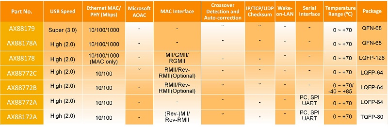

# [ETH-USB](https://github.com/OS-Q/D98)

#### 归属电气转换：[W14](https://github.com/OS-Q/W14)

#### 关于系统架构：[OS-Q](https://github.com/OS-Q/OS-Q)

Edge*Q -> 体系 Q[1,4] -> 节点 M[1,12] -> 平台 W[1,52] -> 设备 D[1,365]

### [设备描述](https://github.com/OS-Q/D98/wiki)

IEEE802.3标准为以太网遵循技术标准，规定的主要是位于参考模型的物理层(PHY)和数据链路层中的介质访问控制子层(MAC)。

* 以太网通信结构总分层七个层（OSI模型）：应用层、表示层、会话层、传输层、网络层、数据链路层以及物理层。
* IEEE 802.11是无线局域网=WiFi，IEEE 802.15是个人域网=蓝牙

在物理层(PHY)，由IEEE 802.3标准规定了以太网使用的传输介质、传输速度、数据编码方式和冲突检测机制，物理层一般是通过一个PHY芯片实现其功能的。

传输介质包括同轴电缆、双绞线(水晶头网线是一种双绞线)、光纤。根据不同的传输速度和距离要求，基于这三类介质的信号线又衍生出很多不同的种类。最常用的是"五类线"适用于100BASE-T和10BASE-T的网络，它们的网络速率分别为100Mbps和10Mbps。在10BASE-T的传输方式中采用曼彻斯特编码，在100BASE-T中则采用4B/5B编码。

[ TCP/IP模型中 ]  数据链路层又被分为LLC层(逻辑链路层)和MAC层(媒体介质访问层)，MAC层属于数据链路层的下半部分，主要负责与物理层进行数据交接，如是否可以发送数据，发送的数据是否正确，对数据流进行控制等。它自动对来自上层的数据包加上一些控制信号，交给物理层。接收方得到正常数据时，自动去除MAC控制信号，把该数据包交给上层。

物理层和MAC子层主要由硬件实现，也是Ethernet 通信和其他网络通信（如WiFi）最大的区别，之上的各种协议层为软件实现，没有太大区别。

以太网是一种基带局域网技术，所有的站点共享一个通信信道，数据在局域网中传输时，采用的是广播型式，通过比较自己的MAC地址和数据帧中包含的目的地MAC地址来判断该帧是否是发往自己，以太网的拓扑结构是星型，但在逻辑上仍然使用总线型拓扑。

以太网包头14字节的内容为：

* 6字节的目的MAC地址
* 6字节的本机MAC地址
* 2字节的类型（前字节为08，后字节为00或06，表示IP包或ARP包）

由于以太网的诸多限制，现在很多嵌入式设备都不再提供相应的物理接口，需要通过相应的转换接口实现连接，而针对计算类设备最常用的就是USB接口。

ETH支持介质独立接口(MII)和简化介质独立接口(RMII)用于与外部PHY芯片连接。介质独立接口(MII)用于理解MAC控制器和PHY芯片，MII需要16根通信线，RMII只需7根通信，但在功能上是相同的。

站管理接口(SMI)接口专门用于与外部PHY通信，用于访问PHY芯片寄存器，PHY芯片是物理层功能实现的实体，生活中常用水晶头网线+水晶头插座+PHY组合构成了物理层。

### [设备资源](https://github.com/OS-Q/D98)

* [资源](src/)
* [文档](docs/)
* [asix方案](asix/)
    * [AX88179](asix/AX88179) 
    * [AX88772](asix/AX88772) 

### [设备相关](https://github.com/OS-Q/D98)

* W14：[电气转换](https://github.com/OS-Q/W14)
    * D92：[IIC-COM](https://github.com/OS-Q/D92)
    * D93：[485-COM](https://github.com/OS-Q/D93)
    * D94：[485-USB](https://github.com/OS-Q/D94)
    * D95：[USB-COM](https://github.com/OS-Q/D95)
    * D96：[USB-PCIE](https://github.com/OS-Q/D96)
    * D97：[ETH-COM](https://github.com/OS-Q/D97)
    * D98：ETH-USB

### [OS-Q : Operation System for edge devices](http://www.OS-Q.com/Edge/D98)
####  2019-5-19